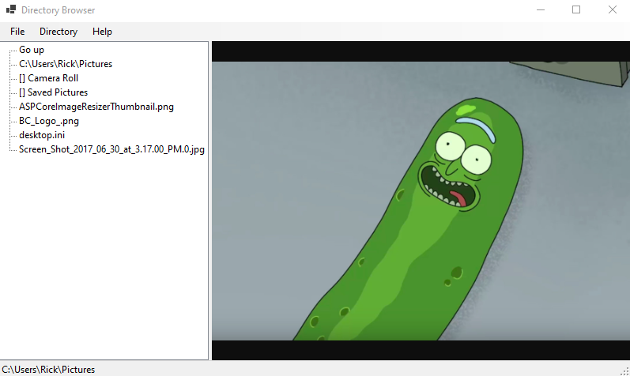

# Directory Browser

Windows Form App that allows for browsing of a local computer's directory.

WebView2 must be installed before running. <a href="https://developer.microsoft.com/en-us/microsoft-edge/webview2/">Get WebView2</a>

Todo
<ul>
<li>Add images to treeView</li>
<li>Add option for users to select supported file extensions</li>
<li>Add option to copy path of file</li>
<li>Show file size</li>
<li>Show + sign if folder contains something</li>
<li>Show date modified</li>
</ul>