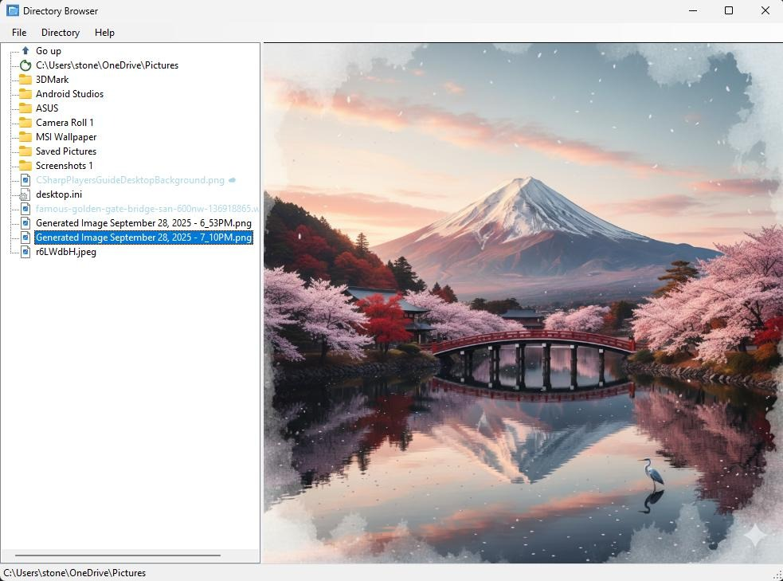

<p align="center" style="display: flex; align-items: center;">
  
  <span style="font-size:2em; vertical-align:middle;"><b>Directory Browser</b></span>
</p>

A modern, feature-rich Windows Forms application for browsing and previewing files on your local computer with integrated **OneDrive support** and advanced file management capabilities.



## 🌟 Features

### 🗂️ **Intuitive File Navigation**
- **Tree-based directory structure** for easy navigation
- **Custom navigation icons** with modern design
- **Drive selection** - Browse all available drives
- **Parent directory navigation** with dedicated "Go up" button
- **Directory refresh** functionality to stay up-to-date

### 🎨 **Rich File Preview**
- **Built-in file viewer** powered by Microsoft WebView2
- **Multi-format support** for various file types:
  - **Web Files**: HTML, HTM, CSS, JavaScript (JS)
  - **Images**: JPG, JPEG, PNG, GIF, SVG, BMP
  - **Documents**: TXT, MD (Markdown), INI, SQL, JSON
  - **Code Files**: Python (PY), and more
- **Smart file type detection** with visual indicators
- **Color-coded file display** (supported files in black, others in gray)

### ☁️ **Advanced OneDrive Integration**
- **Real-time OneDrive status detection**
- **Visual cloud indicators** (☁️) for cloud-only files
- **Smart file availability warnings** before attempting to open cloud files
- **OneDrive Files On-Demand support**
- **Automatic cloud file identification** using Windows file attributes
- **Detailed OneDrive status information** via context menu

### 🖱️ **Enhanced Context Menus**
#### For Files:
- **Copy File Path** - Instantly copy full file path to clipboard
- **OneDrive Status** - View detailed cloud storage information
- **Smart cloud file handling** with download prompts

#### For Folders:
- **Copy Folder Path** - Quick access to directory paths
- **Professional folder navigation**

### 🎯 **User Experience Features**
- **System icon integration** - Native Windows file/folder icons
- **Professional status bar** with real-time feedback
- **Tooltip support** showing file and OneDrive status
- **Smooth navigation** without unwanted folder opening on right-click
- **Modern UI design** with gradient icons and professional styling

## 🛠️ **Technical Specifications**

### **Framework & Platform**
- **.NET 9.0** - Latest Microsoft .NET framework
- **Windows Forms** - Native Windows application
- **C# 13.0** - Modern C# language features
- **Microsoft WebView2** - Chromium-based rendering engine

### **System Requirements**
- **Windows 10/11** (x64)
- **.NET 9.0 Runtime**
- **Microsoft WebView2** ([Download here](https://developer.microsoft.com/en-us/microsoft-edge/webview2/))

### **Dependencies**
```xml
<PackageReference Include="Microsoft.Web.WebView2" Version="1.0.961.33" />
```

## 🚀 **Getting Started**

### **Prerequisites**
1. Install [.NET 9.0 Runtime](https://dotnet.microsoft.com/download/dotnet/9.0)
2. Install [Microsoft WebView2](https://developer.microsoft.com/en-us/microsoft-edge/webview2/)

### **Installation**
1. Clone the repository:
   ```bash
   git clone https://github.com/Stone98/DirectoryBrowser.git
   ```
2. Open the solution in Visual Studio 2022
3. Build and run the application

### **Usage**
1. **Navigate directories** by clicking on folders in the tree view
2. **Preview files** by clicking on supported file types
3. **Right-click** on files/folders for context menu options
4. **Copy paths** quickly using the context menu
5. **Monitor OneDrive status** with visual indicators and detailed information

## 🏗️ **Architecture**

### **Core Components**
- **`Form1.cs`** - Main application form and logic
- **`OneDriveHelper.cs`** - OneDrive integration and cloud file detection
- **`FileIconHelper.cs`** - Windows system file icon extraction
- **`FolderIconHelper.cs`** - Folder icon management
- **`GoUpIconHelper.cs`** - Custom navigation icon generation
- **`RefreshIconHelper.cs`** - Modern refresh icon creation

### **Key Features Implementation**
- **File Attribute Analysis** - Uses Windows file attributes to detect OneDrive Files On-Demand
- **Custom Icon Generation** - GDI+ based icon creation with gradients and modern styling
- **Context-Aware UI** - Different behaviors for files vs. folders
- **WebView2 Integration** - Seamless file preview with web technologies

## 🎨 **Design Highlights**

### **Modern Visual Elements**
- **Gradient-based custom icons** for navigation and refresh
- **Professional color scheme** (blue for navigation, green for refresh)
- **Visual OneDrive integration** with cloud symbols and status colors
- **System-native file icons** for authentic Windows experience

### **User Experience**
- **Intelligent right-click handling** - No accidental folder navigation
- **Smart file opening warnings** for OneDrive cloud files
- **Real-time status updates** in the status bar
- **Tooltip information** for enhanced usability

## 🔧 **Advanced Features**

### **OneDrive Detection Algorithm**
The application uses sophisticated file attribute detection:
```csharp
FILE_ATTRIBUTE_RECALL_ON_OPEN        // File will download when opened
FILE_ATTRIBUTE_RECALL_ON_DATA_ACCESS // File will download when accessed
```

### **Supported OneDrive States**
- **`CloudOnly`** - File exists in cloud but not downloaded locally
- **`LocallyAvailable`** - File is cached locally and immediately accessible
- **`NotOneDrive`** - Regular file not managed by OneDrive
- **`Unknown`** - Unable to determine status

## 📈 **Performance & Reliability**

- **Efficient file system operations** with proper exception handling
- **Memory-conscious icon management** with proper disposal
- **Responsive UI** with non-blocking operations
- **Robust error handling** for network and file system issues

## 🎯 **Use Cases**

- **File Management** - Quick navigation and file preview
- **OneDrive Administration** - Monitor cloud file status and availability
- **Development Workflow** - Preview code files, configurations, and documentation
- **Content Review** - Quick preview of images, web files, and documents
- **System Administration** - Efficient directory browsing with path copying

## 🚀 **Future Enhancements**

- **Multiple view modes** (List and Table views)
- **File size display**
- **Date modified information**
- **Search functionality**
- **Customizable file extension support**
- **Folder content indicators** (+ sign for non-empty folders)

## 👨‍💻 **Author**

**Stone98** - [GitHub Profile](https://github.com/Stone98)

---


